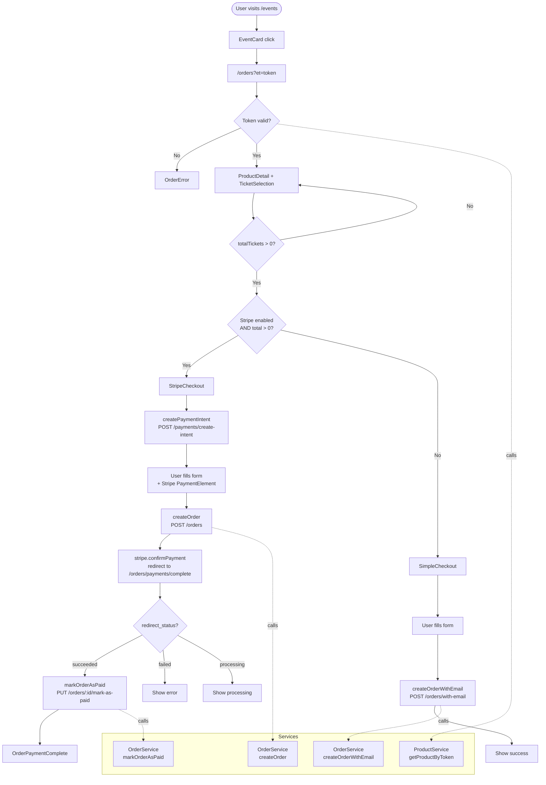

# Cortado – Copilot Instructions

## Architecture

Next.js 15 App Router app (TypeScript + MUI v6) is public website for viewing events and event ticket ordering with optional Stripe payment.

**Key directories:**

- `src/app/` – App Router pages (`/`, `/events`, `/orders`, `/orders/payments/complete`, `/orders/verify`)
- `src/components/` – Client components (MUI-based, no sub-folders)
- `src/services/` – Static-class API wrappers (`ProductService`, `OrderService`)
- `src/hooks/` – Custom React hooks (`useStripePayment`, `usePaymentComplete`)
- `src/types/` – TypeScript interfaces (`api-type.ts`, `order-type.ts`, `product-type.ts`)
- `src/constants/` – Error code strings and dummy event data
- `src/config/api-config.ts` – Single source for `API_CONFIG.BASE_URL`

## Code Style

- All components are MUI-based; use `@mui/material` for layout, typography, and inputs. No custom CSS except `globals.css`.
- Mark any component using browser APIs or hooks with `"use client"` at the top.
- Use the `@/` path alias (maps to `src/`) for all internal imports.
- All API errors follow `ApiProblemDetails` shape (`src/types/api-type.ts`); check `errorData.errors[].code` for specific codes (e.g., `ApiErrorCode.TokenExpired`).
- Error constants are namespaced strings (e.g., `"PRODUCT.FETCH_FAILED"`), defined in `src/constants/`.

## Build & Run

```bash
yarn install       # install dependencies
yarn dev           # dev server at http://localhost:3000
yarn build         # production build
yarn start         # serve production build
yarn lint          # ESLint
```

Docker: `node:18-alpine`, build with `yarn build`, serves on port 3000.

## Project Conventions

**Services** – All API calls are static methods on service classes. Throw using error-constant strings, never raw messages:

```ts
throw new Error(ORDER_ERRORS.CREATE_ORDER_FAILED);
```

See `src/services/order-service.ts` and `src/services/product-service.ts`.

**Checkout flow** – `TicketSelection` → branches on `NEXT_PUBLIC_ENABLE_STRIPE_PAYMENT === "true"` and `total > 0`:

- Paid + Stripe enabled → `StripeCheckout` → `createOrder` → Stripe `confirmPayment` → redirect to `/orders/payments/complete`
- Free or Stripe disabled → `SimpleCheckout` → `createOrderWithEmail`



**Payment complete URL params** – `oid` (orderId), `payment_intent`, `payment_intent_client_secret`, `redirect_status`, `bak` (return URL, encoded), `ts` (encrypted timestamp). Timestamp is validated against a 20-minute expiry using `encryptTimestamp`/`decryptTimestamp` from `src/utils/date-utils.ts`.

**Orders page access** – via `?et=<token>` query param; token is fetched via `ProductService.getProductByToken`. Public event listing uses `DUMMY_EVENTS` from `src/constants/event-constant.ts` (no API call).

**MUI theme** – Defined in `src/styles/theme.ts`, applied globally via `MuiThemeProvider` (`src/components/mui-theme-provider.tsx`). Do not use `sx` color values that bypass the theme palette.

## Integration Points

- **Backend API**: `NEXT_PUBLIC_API_BASE_URL` (default: `https://localhost:7159/api`). Endpoints: `/products/public`, `/products/token`, `/orders`, `/orders/with-email`, `/orders/with-payment`, `/orders/:id/mark-as-paid`, `/orders/verify-order`.
- **Stripe**: `NEXT_PUBLIC_STRIPE_PUBLISHABLE_KEY` for `loadStripe`; payment intent created via backend at `/payments/create-intent`.
- **Next.js image domains**: `picsum.photos`, `images.unsplash.com`, and S3 bucket – add new domains to `next.config.ts` `images.domains`.

## Environment Variables

```env
NEXT_PUBLIC_API_BASE_URL=https://localhost:7159/api
NEXT_PUBLIC_STRIPE_PUBLISHABLE_KEY=pk_test_...
NEXT_PUBLIC_ENABLE_STRIPE_PAYMENT=true   # set to "true" to enable Stripe flow
```
